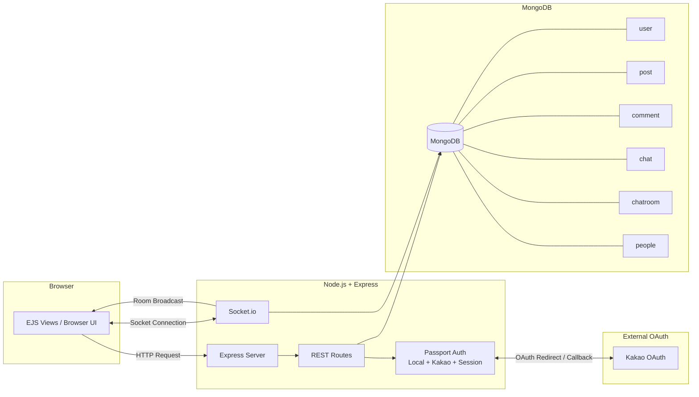

# 코사모 - 코딩할 사람들의 모임

커뮤니티(게시글/댓글)와 실시간 채팅을 결합해 **코딩 학습자들이 글과 대화로 함께 성장**할 수 있도록 만든 서버 렌더링 기반 서비스입니다.

## 1) 프로젝트 소개

### 프로젝트 목적
- 게시판 중심 소통(정보 공유)과 실시간 대화(즉시 협업)를 한 서비스 안에서 제공
- 학습자들이 글 작성 → 댓글 토론 → 1:1/스터디룸 채팅으로 자연스럽게 이어지는 흐름 구현

### 왜 커뮤니티 서비스를 만들었는가
- 단순 게시글 CRUD만으로는 사용자 상호작용의 속도와 밀도가 낮다고 판단
- 검색/태그/프로필 기능을 통해 사람과 글을 연결하고, 학습 네트워크를 만들고자 함

### 실시간 채팅을 추가한 이유
- 질문/피드백을 댓글만으로 해결하기 어려운 상황에서 즉시 대화가 필요
- Socket.io 기반 room 단위 메시징으로 1:1 채팅과 스터디룸 대화를 지원

### 목표 사용자 경험
- 로그인 후 바로 글 작성/탐색 가능
- 관심 글에서 작성자와 즉시 대화 시작 가능
- 마이페이지에서 내 활동(글/댓글/추천)을 한 번에 추적 가능

## 2) 주요 기능

- **회원가입 / 로그인 / 로그아웃** (Passport Local + 세션)
- **Kakao OAuth 로그인**
- **게시글 CRUD** (작성/목록/상세/수정/삭제)
- **댓글 기능** (게시글 상세 기반)
- **실시간 채팅** (join-room, chat-message 이벤트)
- **프로필 / 마이페이지** (프로필 편집, 내 활동 조회)
- **사용자 간 커뮤니케이션**
  - 1:1 채팅방 생성
  - 스터디룸 생성/참여/초대

## 3) 기술 스택

- **Frontend**: EJS, Vanilla JavaScript, Tailwind CSS
- **Backend**: Node.js, Express
- **Database**: MongoDB, connect-mongo
- **Realtime**: Socket.io
- **Auth**: Passport (LocalStrategy, KakaoStrategy), express-session, bcrypt

## 4) UI 스크린샷

> 기존 README의 이미지 링크를 유지했습니다.

### Main UI


- 게시글 중심 커뮤니티 메인 화면

### Realtime Chat


- 채팅방 입장 후 실시간 메시지 송수신 화면

### 기타 기능 화면
- 프로필 편집, 마이페이지, 스터디룸/초대 화면은 `views/` 기반 서버 렌더링으로 구현

---

## 5) 시스템 아키텍처



### 흐름 구분
- **HTTP 요청 흐름**: Browser → Express REST → Passport 인증/권한 확인 → MongoDB CRUD
- **Socket 이벤트 흐름**: Browser Socket 연결 → `join-room` → `chat-message` 저장(`chat`) → room 브로드캐스트

## 6) 프로젝트 구조

```text
.
├─ public/        # 정적 파일(CSS, 이미지)
├─ views/         # EJS 템플릿(로그인, 게시판, 채팅, 프로필, 스터디룸)
├─ server.js      # Express 라우팅, Passport 인증, Socket.io 이벤트, DB 접근
├─ package.json
└─ Readme.md
```

> 현재 코드는 라우트/미들웨어/소켓/모델이 `server.js`에 통합된 구조입니다.

## 7) 주요 기능 흐름

### 회원가입 / 로그인
1. `/register`에서 아이디/비밀번호 입력
2. 비밀번호 `bcrypt.hash` 후 `user` 컬렉션 저장
3. `/login`에서 Passport LocalStrategy 인증
4. 성공 시 세션 직렬화(`serializeUser`) 후 로그인 유지

### Kakao OAuth 인증
1. `/auth/kakao`로 카카오 인증 페이지 이동
2. `/auth/kakao/callback`에서 Passport KakaoStrategy 처리
3. 신규 사용자면 `user` 컬렉션에 provider/snsId 기반 생성
4. 닉네임이 없으면 `/set-username`으로 유도

### 게시글 / 댓글 CRUD
- 게시글: `/add`, `/edit/:id`, `/delete`, `/detail/:id`, `/list`
- 댓글: `/comment`에서 `parentId`(게시글 ID) 기준 저장 및 상세 재진입

### Socket.io 기반 실시간 채팅
1. 채팅방 페이지 진입(`/chat/room/:id` 또는 `/studyroom/:id`)
2. 클라이언트가 `join-room(roomId)` 전송
3. 메시지 전송 시 `chat-message` 이벤트 송신
4. 서버가 `chat` 컬렉션 저장 후 동일 room에 브로드캐스트

### 세션 유지 흐름
- `express-session` + `connect-mongo`로 세션을 MongoDB에 저장
- Express와 Socket.io가 동일 session middleware를 공유

## 8) MongoDB 모델(컬렉션) 구조 요약

- **User (`user`)**
  - 로컬 로그인: `username`, `password(hash)`
  - 카카오 로그인: `provider`, `snsId`, `email`, `username`
- **Post (`post`)**
  - `title`, `content`, `authorId`, `authorName`, `tags`, `like/dislike` 정보
- **Comment (`comment`)**
  - `parentId`(Post 참조), `content`, `authorId`, `authorName`
- **ChatMessage (`chat`)**
  - `parent`(chatroom/studyroom ID), `userId`, `content`, `createdAt`
- (관련) **chatroom / people / invitation**
  - 채팅방, 프로필, 초대 흐름 지원

## 9) REST API 구조 요약

### 인증
- `POST /register` 회원가입
- `POST /login` 로그인
- `GET /auth/kakao` 카카오 OAuth 시작

### 게시글/댓글
- `POST /add` 게시글 작성
- `POST /comment` 댓글 작성
- `POST /post/:id/vote` 추천/비추천

### 채팅/프로필
- `GET /chat/request` 1:1 채팅방 생성/재사용
- `GET /chat/room/:id` 채팅방 입장
- `POST /profile/edit` 프로필 저장

예시:
```http
POST /comment
Content-Type: application/x-www-form-urlencoded

parentId=<postId>&content=좋은 글 감사합니다!
```

```json
{ "ok": true }
```

## 10) 실시간 채팅 구조

- **join-room 흐름**
  - 클라이언트가 room ID로 입장 이벤트 전송
  - 서버는 `socket.join(roomId)`로 해당 소켓을 room에 바인딩

- **chat-message 이벤트 흐름**
  - 클라이언트 → 서버: `{ roomId, senderId, message }`
  - 서버: MongoDB `chat` 저장
  - 서버 → room 참여자: `socket.to(roomId).emit('chat-message', payload)`

- **room 기반 브로드캐스트**
  - 전체가 아닌 같은 room 소켓에게만 전송
  - 1:1 채팅과 스터디룸 채팅 모두 동일 패턴 활용

## 11) 트러블슈팅 (구현 기준)

- **실시간 메시지 처리**: 메시지를 먼저 DB에 저장한 뒤 브로드캐스트하여 이력 일관성 유지
- **Socket 이벤트 설계**: `join-room`과 `chat-message`로 이벤트 책임 분리
- **세션 기반 인증 처리**: `connect-mongo`로 세션 영속화, 재시작 이후 로그인 유지 기반 확보
- **OAuth 처리**: 카카오 콜백에서 신규 사용자 자동 생성 및 닉네임 보완 플로우 연결
- **MongoDB 연결 구조**: 단일 `MongoClient` 연결 후 `app.locals.db`와 전역 참조로 라우트 재사용

## 12) 실행 방법

### 1) 설치 및 실행
```bash
npm install
npm start
```

### 2) 환경 변수 예시 (`.env`)
```env
MONGODB_URI=mongodb://127.0.0.1:27017
MONGODB_DB_NAME=forum
SESSION_SECRET=your_session_secret
KAKAO_CLIENT_ID=your_kakao_rest_api_key
KAKAO_CALLBACK_URL=http://localhost:8080/auth/kakao/callback
```

### 3) MongoDB 연결
- `MONGODB_URI`, `MONGODB_DB_NAME`를 기준으로 앱 시작 시 DB 연결

### 4) Kakao OAuth 설정
- Kakao Developers에서 Redirect URI를
  `http://localhost:8080/auth/kakao/callback` 으로 등록

## 13) 배운 점 / 개선 방향

### 배운 점
- REST + Socket.io 혼합 구조에서 요청/이벤트 경로를 분리해 설계하는 방법
- 커뮤니티 데이터(Post/Comment)와 실시간 데이터(Chat) 흐름을 함께 운영하는 방법
- Passport 기반 Local/OAuth 인증과 세션 유지 방식

### 개선 방향
- `server.js` 단일 파일 구조를 `routes/`, `middleware/`, `socket/`, `models/`로 모듈화
- 세션/실시간 확장성을 위한 Redis 도입 검토
- API 서버와 프론트(예: React) 분리 아키텍처로 확장 가능성 검토
- 채팅 권한 검증(룸 멤버십)과 이벤트 ACK 처리 강화
